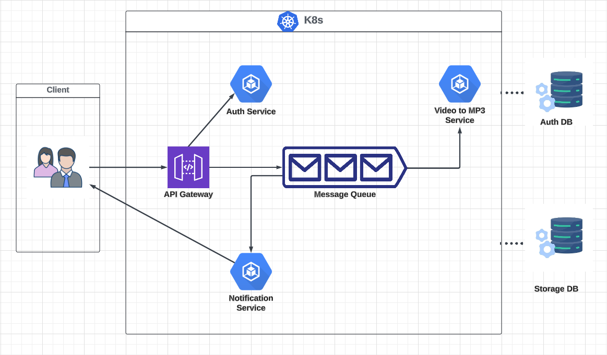
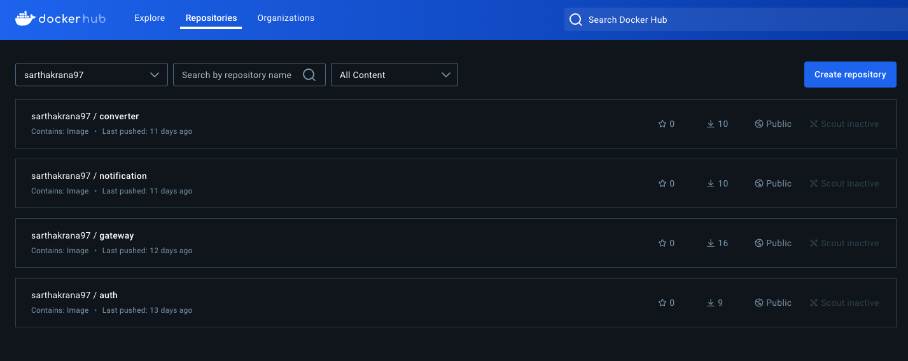
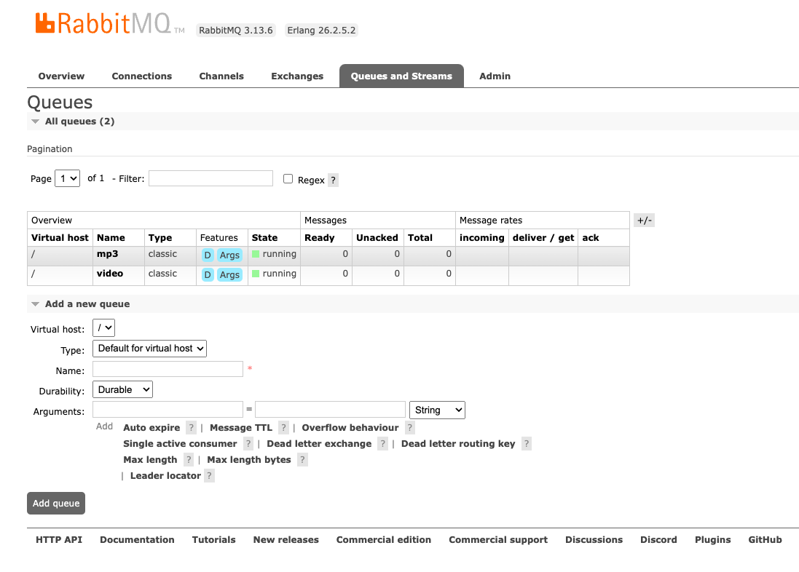
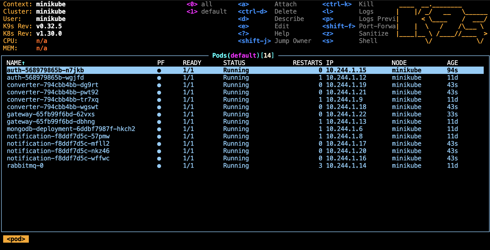
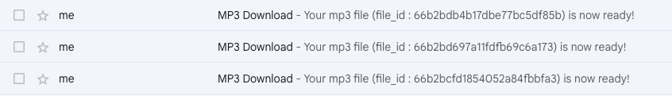

# Video To MP3 Converter App

This is a Video to MP3 converter app. The use case in itself is very simple - take a video file, extract its audio and save it in an MP3 file. The focus in this project is to design a microservices architecture and see how different services intercommunicate and how a distributed system is integrtated as a whole.

To convert the microservices architecture into an application, I would be using Python, Docker, Kubernetes, MySQL, MongoDB and RabbitMQ. Let's go over what the application architecture looks like:

```
Please don't forget to ⭐ this repo if you found it helful.
```

## Architecture



1. A user will upload a video file and send request to our application. This request is entertained by the API Gateway.
2. If the user is not logged in, the API gateway sends the request to the Auth service which returns a response with a JWT token. This JWT token will be attached to each subsequent request and will be validated for each request.
3. Here, the auth DB (MySQL server) is used to store user login details like email and password.
4. Now, the user is logged in. The user then uploads a video. This video is stored in our storage DB (MongoDB) and a message containing details of video file is pushed into the message queue (RabbitMQ).
5. The consumer (video to mp3) service is continuously polling the message queue. It will read the message from queue, fetch the video from DB, extract the audio, save it in a .mp3 file and push this mp3 file into DB.
6. Apart from this, the consumer service pushes a message back into the message queue with details of mp3 file created.
7. The notification service, which is continuously polling the message queue reads this message and sends an email notification to user which contains the audio file id informing that their mp3 file is ready to download.
8. The user then uses the id provided in the email to download their audio files.
## Tech Stack

- Python
    - Flask framework
    - Pika library 
    - Moviepy library
    - SMTP library
    - JWT library
- MongoDB
    - GridFS
- MySQL 
- Docker 
- Kubernetes
- RabbitMQ
## Installation & Setup

1. Clone this repo to your local system.
2. Make sure you have the following things installed: 
    - Docker Desktop
    - Kubernetes Command Line Tool (kubectl)
    - Minikube
    - K9s (https://k9scli.io/topics/install/)
    - MySQL
    - Python3 

3. To deploy each service, first run the dockerfile of each service. This will create a repository for each service.
```
cd <service-directory>
docker build .
docker tag <SHA_Key> <docker_image>:latest
docker push <docker_image>:latest
```
To check, go to https://hub.docker.com/ . Here, you should be able to see your repositories.

4. Next, to deploy service as a pod in kubernetes cluster:
```
cd <service-directory>
kubectl apply -f ./manifests
```
This will deploy the service as a pod (with defined replicas) in a kube cluster. To check, run below command in terminal
```
k9s
```
5. **Note:** *Since the kubernetes cluster is private, to access the cluster from outside, I have set up an ingress to access the API gateway. This ingress will act as an entry point to our private kubernetes cluster. In order to make cluster accessible, run the below commands in a separate terminal window (DO NOT CLOSE THIS WINDOW). Also make sure that the docker daemon is up and running*

```
minikube start
minikube tunnel
```
This will tunnel all the requests made to ingress to the API gateway.

6. To create queues in RabbitMQ, go to www.rabbitmq-manager.com . You will only be able to access the GUI once you have deployed rabbitmq service as mentioned in step 4. Login using the following credentials:
```
username: guest
password: guest
```

7. Once you are able to access the GUI, go to ```Queues and Streams``` tab. Here create 2 queues with names:
```
videos
mp3s
```
Select *type* as ```Classic``` and *durability* as ```Durable``` for both queues. Leave rest as it is.

8. **Pro Tip:** If you get stuck and find yourself debugging any service or code, scale down the replicas of services to ease debugging using the following command:
    
    ```kubectl scale deployment --replicas=1  <SERVICE-1> <SERVICE-2> <SERVICE-3>```
    ## Usage

To test services and functionalities, you can use Postman or CURL commands. Below are the CURL commands you can use:

1. To login:
```
curl -X POST -u <EMAIL_ID>:<PASSWORD> http://mp3converter.com/login
```
**Use the email id and password mentioned in auth > init.sql > INSERT INTO query. You can create your own user as well with email id and password of your choice.**

2. To upload a video file:
```
curl -X POST -F 'file=@./test.mp4' -H 'Authorization: Bearer <JWT_TOKEN>' http://mp3converter.com/upload
```

3. To download mp3 file:
```
curl --output mp3_download.mp3 -X GET -H 'Authorization: Bearer <JWT_TOKEN>' "http://mp3converter.com/download?fid=<ID_FROM_EMAIL>"
```
## Screenshots

Docker Hub



Rabbit MQ GUI



K9s (Services as pods)



Email Notifications

